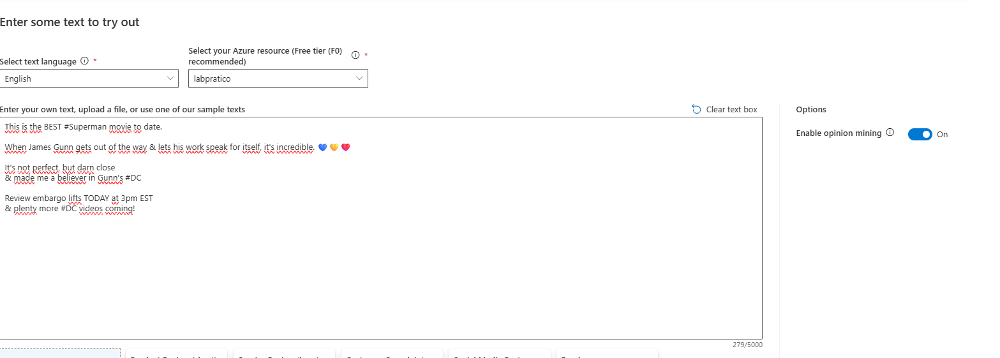
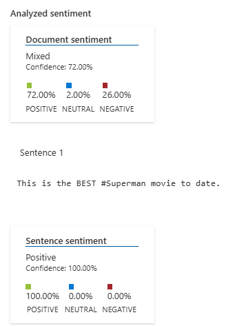
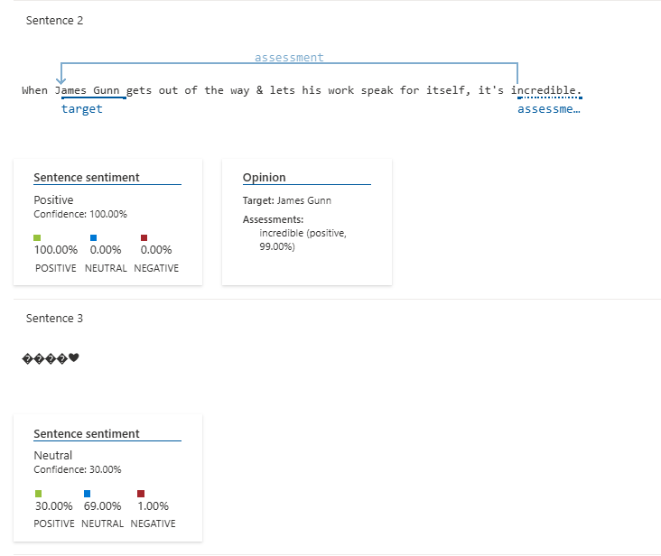
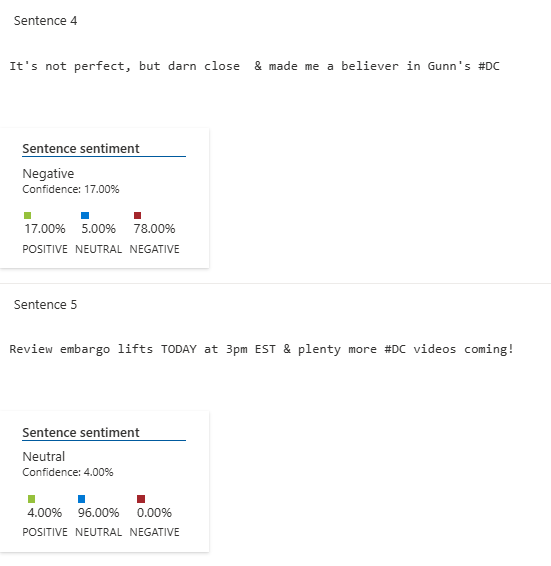
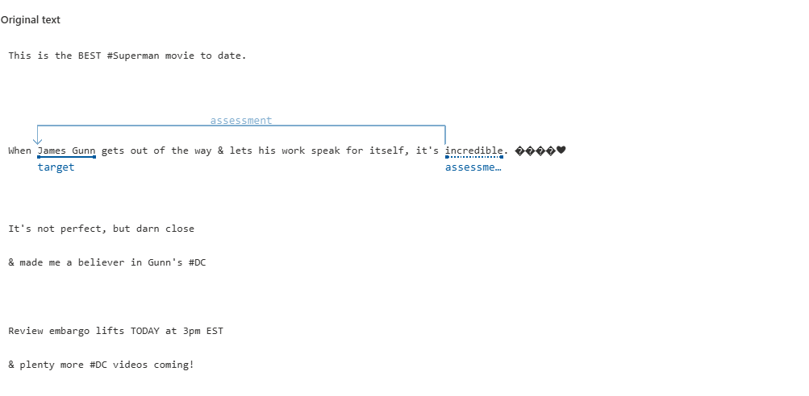

# Projeto 1: Azure Speech Studio e Language Studio

Este projeto tem como finalidade **exercitar e aprimorar o uso das ferramentas Azure Speech Studio e Language Studio**, com foco na **análise de fala** e no **processamento de linguagem natural**. A proposta é desenvolver **competências práticas** na criação de soluções com inteligência artificial aplicadas à voz e ao entendimento da linguagem.

---

## 🗣️ Azure Speech Studio

### ✅ Etapas do Projeto

1. **Criar um novo recurso.**
2. **Registrar o provedor `Microsoft.CognitiveServices`** na assinatura de estudante.
3. **Selecionar o recurso criado.**
4. **Realizar conversão de fala em texto em tempo real.**
5. **Testar a ferramenta utilizando um áudio.**  
   A transcrição esperada foi:

   > _"Cheguei - E aí meu amor, você aprendeu tudo? - Eu acho que não, vou ter que voltar amanhã"._

   

---

### 📘 Recursos e Guias

- Link para o [GitHub com exemplos por linguagem](https://github.com/Azure-Samples/cognitive-services-speech-sdk).
- Página com os **cenários mais comuns**, **serviços relacionados**, **estimativas de preço** e **uso responsável de IA**.

---

### 💡 Cenários Mais Comuns

- Criação de **legendas automáticas**.
- Transcrição e análise de **chamadas de call center**, utilizando os serviços de **Fala e Idioma** do Azure.

---

### 🔗 Serviços Relacionados

- **Fala personalizada**  
  Adapta a precisão da conversão de fala com base no vocabulário da empresa.

- **Galeria de serviços de voz**  
  Lista de locutores de IA disponíveis para uso.

- **Avaliação de pronúncia**  
  Ferramenta voltada para o aprendizado de idiomas, com feedbacks de pronúncia.

---

### 💰 Avaliação de Preço

- Estimativa de custos baseada na quantidade de minutos processados, região do recurso e tipo de modelo usado.
- Consulte [a calculadora de preços do Azure](https://azure.microsoft.com/pt-br/pricing/calculator/) para mais detalhes.

---

## 🧠 Language Studio

### ✅ Etapas do Projeto

1. **Criação de um recurso Language Service.**
2. **Acesso ao site:**  
   [https://language.cognitive.azure.com/home](https://language.cognitive.azure.com/home)
3. **Filtrar por "Classificação de texto"** e selecionar **"Analisar sentimentos e opiniões"**.
4. **Teste prático:**  
   Foi utilizado um comentário retirado de uma crítica de cinema para verificar como a IA detecta emoções.

   **Texto analisado:**

   > _"This is the BEST #Superman movie to date.  
   > When James Gunn gets out of the way & lets his work speak for itself, it's incredible. 💙💛❤️  
   > It's not perfect, but darn close & made me a believer in Gunn's #DC  
   > Review embargo lifts TODAY at 3pm EST & plenty more #DC videos coming!"_

---

### 🖼️ Imagens

  
 _Este print mostra como foi enviado o texto para análise._

  
 _Mostra como a IA classificou o texto no geral e como a primeira sentença foi analisada corretamente._

  
 _A segunda sentença também foi interpretada de forma correta. No entanto, na terceira, apenas o último emoji (coração) foi compreendido._

  
 _A sentença 4 foi analisada de forma incorreta. O nível de confiança atribuído pela IA também foi bem baixo._

  
 _Exibição do texto original completo que foi analisado._

---

### 📘 Documentação

Assim como no Speech Studio, a plataforma oferece:

- **Tutoriais guiados**
- **Repositórios no GitHub com exemplos**
- **Estimativas de custo**
- **Diretrizes sobre o uso responsável de IA**
